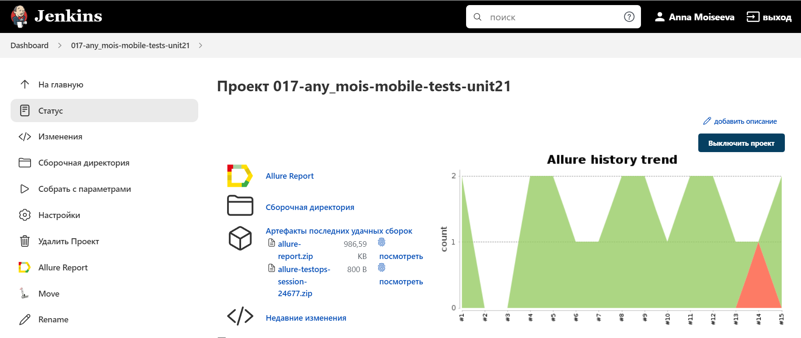

# Проект по автоматизации мобильного тестирования  "Wikipedia"

## :pushpin: Содержание:

- [Технологии и инструменты](#earth_africa-технологии-и-инструменты)
- [Реализованные тесты](#earth_africa-Реализованные-проверки)
- [Сборка в Jenkins](#earth_africa-Jenkins-job)
- [Запуск из терминала](#earth_africa-Запуск-тестов-из-терминала)
- [Allure отчет](#earth_africa-Allure-отчет)
- [Интеграция с Allure TestOps](#earth_africa-Интеграция-с-Allure-TestOps)
- [Отчет в Telegram](#earth_africa-Уведомление-в-Telegram-при-помощи-бота)
- [Видео примеры прохождения тестов](#earth_africa-Примеры-видео-о-прохождении-тестов)

## :rocket: Технологии и инструменты

<p align="center">
<a href="https://www.jetbrains.com/idea/"></a>
<a href="https://www.java.com/"></a>
<a href="https://github.com/"></a>
<a href="https://junit.org/junit5/"></a>
<a href="https://gradle.org/"></a>
<a href="https://selenide.org/"></a>
<a href="https://aerokube.com/selenoid/"></a>
<a href="https://github.com/allure-framework/allure2"></a>
<a href="https://www.jenkins.io/"></a>
<a href="https://developer.android.com/studio/"></a>
<a href="https://appium.io/"></a>
<a href="https://https//www.browserstack.com/"></a>
</p>

## :scroll: Реализованные тесты

- ✓ Checking 'java' in search of Wikipedia.
- ✓ Checking 'About' in settings.
- ✓ Checking com.browserstack.Sample.
- ✓ Checking onboarding screen.

## </a> Jenkins job
<a target="_blank" href="https://jenkins.autotests.cloud/job/017-any_mois-mobile-tests-unit21/16/">Сборка в Jenkins</a>
<p align="center">
</a>
</p>

### Параметры сборки в Jenkins:

- PLATFORM (android или ios - для выбора платформы и запуска соответствующих тестов)

## :computer: Запуск тестов из терминала

Локальный запуск:
```bash
gradle clean emulator -Denv=emulator
gradle clean android -Denv=android
gradle clean ios -Denv=ios
```

Удаленный запуск:
```bash
clean ${PLATFORM} -Denv=${PLATFORM}
```
где PLATFORM принимает значение android или ios


## </a> Отчет в <a target="_blank" href="https://jenkins.autotests.cloud/job/017-any_mois-mobile-tests-unit21/16/allure/">Allure report</a>

### Основное окно

<p align="center">

</p>

### Тесты

<p align="center">

</p>


## </a>Интеграция с <a target="_blank" href="https://allure.autotests.cloud/launch/22486">Allure TestOps</a>

### Дашборд

<p align="center">

</p>

### Тест-кейсы

<p align="center">

</p>

## </a> Уведомление в Telegram при помощи бота

<p align="center">

</p>

### </a> Примеры видео о прохождении тестов

<p align="center">
 
</p>

